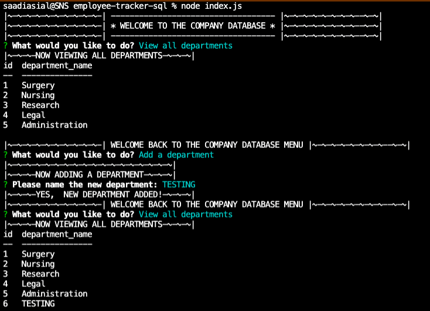
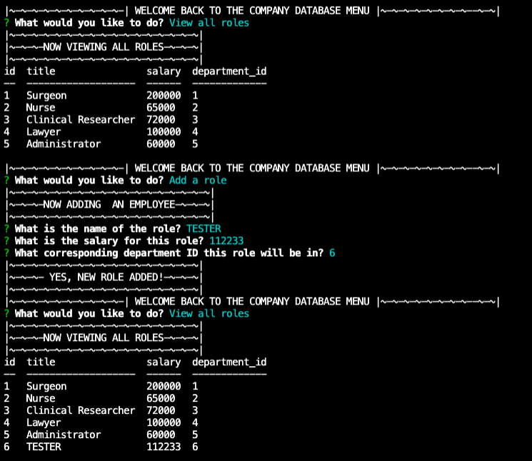
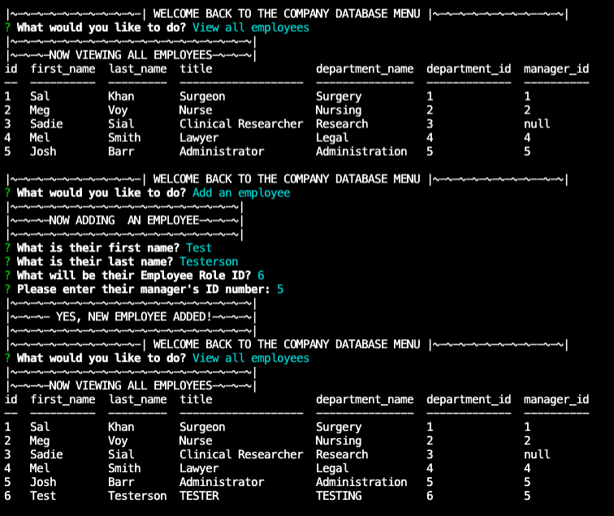
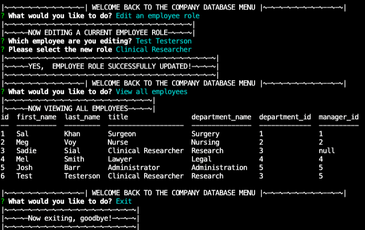

# Employee Tracker (Bootcamp Assignment 12 - MySQL)

By: Sadie Sial

___


#### Table of Contents

* [Description](#description)
* [Installation](#installation)
* [Usage](#usage)
* [Technologies](#technologies)
* [Screenshots](#screenshots)
* [Links](#links)
* [Contact](#contact)
* [License](#license)
<br><br>

## Description <br>

This command-line application allows for users to install, run, and maintain a company database. Users will be able to view, add, and edit departments, roles, and employees within their database.


### User Story:

```
AS A business owner
I WANT to be able to view and manage the departments, roles, and employees in my company
SO THAT I can organize and plan my business
```

```
GIVEN a command-line application that accepts user input
WHEN I start the application
THEN I am presented with the following options: view all departments, view all roles, view all employees, add a department, add a role, add an employee, and update an employee role
WHEN I choose to view all departments
THEN I am presented with a formatted table showing department names and department ids
WHEN I choose to view all roles
THEN I am presented with the job title, role id, the department that role belongs to, and the salary for that role
WHEN I choose to view all employees
THEN I am presented with a formatted table showing employee data, including employee ids, first names, last names, job titles, departments, salaries, and managers that the employees report to
WHEN I choose to add a department
THEN I am prompted to enter the name of the department and that department is added to the database
WHEN I choose to add a role
THEN I am prompted to enter the name, salary, and department for the role and that role is added to the database
WHEN I choose to add an employee
THEN I am prompted to enter the employee’s first name, last name, role, and manager, and that employee is added to the database
WHEN I choose to update an employee role
THEN I am prompted to select an employee to update and their new role and this information is updated in the database 
```

## Installation

1. Users will need to use `git clone` to clone this repo into their local drive. 

- HTTPS
```
https://github.com/sadielinks/employee-tracker-sql.git
```

- SSH
```
git@github.com:sadielinks/employee-tracker-sql.git
```

2. They will then need to run `npm i` in their command line to install the `node_modules` folder necessary for this application.

## Usage

After the installation process, users will then need to run `node index.js`.

They will then be presented with the database welcome screen and a menu to view, add, or edit the database.


## Technologies

The technologies used to create this program were: 
- Javascript
- Node.JS
- MySQL
<br><br>

## Screenshots
```
Command Line - Welcome & Department Functions
```



```
Command Line - Role Functions
```



```
Command Line - Employee Functions
```



```
Command Line - Edit Employee Role Function & Exit
```



```
Walkthrough Video:
```
https://user-images.githubusercontent.com/87392794/138581404-25c86e24-fd33-4e45-b734-f74e09c24767.mov


<br>

## Links

- [Walkthrough Video](https://watch.screencastify.com/v/53gR2d5FKiyu8u2JSQAW)

- [GitHub Repository](https://github.com/sadielinks/employee-tracker-sql)

<br>

## Contact

- [GitHub Profile](https://github.com/sadielinks)
- [Portfolio](https://sadielinks.github.io/professional-portfolio/)
- [Email](mailto:sadiecodes@gmail.com)

<br>

## License

This source code is available to everyone under the standard [MIT license ©](https://choosealicense.com/licenses/mit/) <br><br>
© 2021 Trilogy Education Services, LLC, a 2U, Inc. brand. Confidential and Proprietary. All Rights Reserved.
